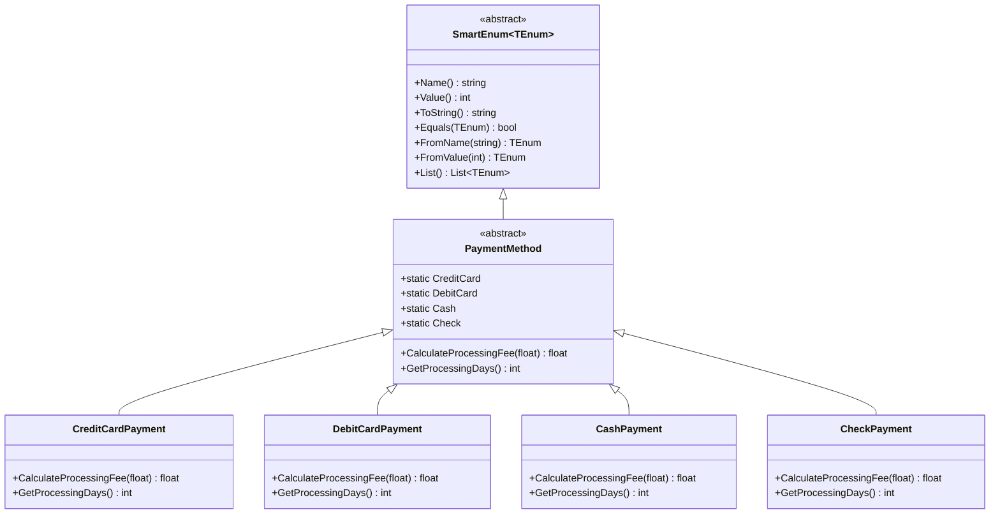

# SmartEnumProject

This project is a C++ port of the [Ardalis.SmartEnum](https://github.com/ardalis/SmartEnum) C# library providing type-safe "smart" enum types and flag enums.

## Features

- **SmartEnum**: Supports name/value registration, lookup (by name and value), and equality comparison.
- **Polymorphic Enums**: Allows custom behavior per enum instance.
- **SmartFlagEnum**: Implements flags with combination logic and validates power-of-two flag definitions.
- **Fluent Switch Interface**: Provides a chainable switch-like API for enums.
- **Unit Tests**: GoogleTest-based tests verify the behavior.

## Documentation

Detailed documentation for each component:

- [SmartEnum](docs/SmartEnum.md) - Basic enum type with name/value lookup
- [SmartFlagEnum](docs/SmartFlagEnum.md) - Flag/bitfield enum with combination support
- [Polymorphic SmartEnum](docs/PolymorphicSmartEnum.md) - Enums with instance-specific behavior
- [SmartEnumSwitch](docs/SmartEnumSwitch.md) - Fluent interface for switch-like patterns

## Examples

### Basic SmartEnum

```cpp
#include <SmartEnumCpp/SmartEnum.hpp>
#include <iostream>

// Define a basic SmartEnum
class Color : public SmartEnum<Color> {
public:
    // Define enum constants
    static const Color Red;
    static const Color Green;
    static const Color Blue;
    
private:
    // Constructor is private, constants are defined outside the class
    Color(const std::string& name, int value) : SmartEnum(name, value) {}
};

// Initialize the constants
const Color Color::Red("Red", 1);
const Color Color::Green("Green", 2);
const Color Color::Blue("Blue", 3);

int main() {
    // Access enum values
    std::cout << "Color Red: " << Color::Red.Name() << " = " << Color::Red.Value() << std::endl;
    
    // Lookup by name
    const Color& foundColor = Color::FromName("Green");
    std::cout << "Found color: " << foundColor.Name() << std::endl;
    
    // Lookup by value
    const Color& colorByValue = Color::FromValue(3);
    std::cout << "Color with value 3: " << colorByValue.Name() << std::endl;
    
    // List all defined values
    std::cout << "All colors:" << std::endl;
    for (const Color* color : Color::List()) {
        std::cout << " - " << color->Name() << std::endl;
    }
    
    return 0;
}
```

### Polymorphic SmartEnum

```cpp
#include <SmartEnumCpp/SmartEnum.hpp>
#include <iostream>

// Define a polymorphic SmartEnum with behavior
class PaymentMethod : public SmartEnum<PaymentMethod> {
public:
    static const PaymentMethod CreditCard;
    static const PaymentMethod DebitCard;
    static const PaymentMethod Cash;
    static const PaymentMethod Check;
    
    // Custom behavior methods
    virtual float CalculateProcessingFee(float amount) const = 0;
    virtual int GetProcessingDays() const = 0;
    
protected:
    // Protected constructor for derived classes
    PaymentMethod(const std::string& name, int value) : SmartEnum(name, value) {}
};

// Implement specific behavior for each payment method
class CreditCardPayment : public PaymentMethod {
public:
    CreditCardPayment() : PaymentMethod("CreditCard", 1) {}
    
    float CalculateProcessingFee(float amount) const override {
        return amount * 0.03f; // 3% fee
    }
    
    int GetProcessingDays() const override {
        return 1; // Processes in 1 day
    }
};

class DebitCardPayment : public PaymentMethod {
public:
    DebitCardPayment() : PaymentMethod("DebitCard", 2) {}
    
    float CalculateProcessingFee(float amount) const override {
        return amount * 0.01f; // 1% fee
    }
    
    int GetProcessingDays() const override {
        return 1; // Processes in 1 day
    }
};

class CashPayment : public PaymentMethod {
public:
    CashPayment() : PaymentMethod("Cash", 3) {}
    
    float CalculateProcessingFee(float amount) const override {
        return 0.0f; // No fee
    }
    
    int GetProcessingDays() const override {
        return 0; // Immediate processing
    }
};

class CheckPayment : public PaymentMethod {
public:
    CheckPayment() : PaymentMethod("Check", 4) {}
    
    float CalculateProcessingFee(float amount) const override {
        return 1.0f; // Fixed $1 fee
    }
    
    int GetProcessingDays() const override {
        return 5; // 5 business days to clear
    }
};

// Initialize the payment method constants
const PaymentMethod PaymentMethod::CreditCard = CreditCardPayment();
const PaymentMethod PaymentMethod::DebitCard = DebitCardPayment();
const PaymentMethod PaymentMethod::Cash = CashPayment();
const PaymentMethod PaymentMethod::Check = CheckPayment();

int main() {
    float purchaseAmount = 100.0f;
    
    for (const PaymentMethod* method : PaymentMethod::List()) {
        float fee = method->CalculateProcessingFee(purchaseAmount);
        int days = method->GetProcessingDays();
        
        std::cout << "Payment method: " << method->Name()
                  << ", Processing fee: $" << fee
                  << ", Processing time: " << days << " days"
                  << std::endl;
    }
    
    // Lookup by name
    const PaymentMethod& selectedMethod = PaymentMethod::FromName("Check");
    std::cout << "\nSelected method: " << selectedMethod.Name() 
              << ", Fee: $" << selectedMethod.CalculateProcessingFee(purchaseAmount)
              << std::endl;
    
    return 0;
}
```

### SmartFlagEnum Example

```cpp
#include <SmartEnumCpp/SmartFlagEnum.hpp>
#include <iostream>

// Define a flag enum for permissions
class FilePermission : public SmartFlagEnum<FilePermission, unsigned int> {
public:
    static const FilePermission None;
    static const FilePermission Read;
    static const FilePermission Write;
    static const FilePermission Execute;
    static const FilePermission Delete;
    
private:
    FilePermission(const std::string& name, unsigned int value) : SmartFlagEnum(name, value) {}
};

// Initialize the flag values (must be powers of 2)
const FilePermission FilePermission::None("None", 0);
const FilePermission FilePermission::Read("Read", 1);      // 2^0
const FilePermission FilePermission::Write("Write", 2);    // 2^1
const FilePermission FilePermission::Execute("Execute", 4); // 2^2
const FilePermission FilePermission::Delete("Delete", 8);  // 2^3

int main() {
    // Display all defined flags
    std::cout << "Defined flags:" << std::endl;
    for (const FilePermission* flag : FilePermission::List()) {
        std::cout << "  " << flag->Name() << " = " << flag->Value() << std::endl;
    }
    
    // Combine flags using the | operator
    unsigned int rwPermissions = FilePermission::Read | FilePermission::Write;
    std::cout << "Read|Write value: " << rwPermissions << std::endl;
    
    // Convert combined value back to string representation
    std::string permissionsStr = FilePermission::FromValueToString(rwPermissions);
    std::cout << "Permissions: " << permissionsStr << std::endl;
    
    // Get individual flags from a combined value
    std::vector<const FilePermission*> flags = FilePermission::FromValue(rwPermissions);
    std::cout << "Flag count: " << flags.size() << std::endl;
    for (const FilePermission* flag : flags) {
        std::cout << " - " << flag->Name() << std::endl;
    }
    
    // Parse from a comma-separated string
    std::vector<const FilePermission*> parsedFlags = 
        FilePermission::FromName("Read, Execute");
    
    unsigned int combinedValue = 0;
    for (const FilePermission* flag : parsedFlags) {
        combinedValue |= flag->Value();
    }
    
    std::cout << "Parsed from 'Read, Execute': " << combinedValue << std::endl;
    
    return 0;
}
```

### Using the Fluent Switch

```cpp
#include <SmartEnumCpp/SmartEnum.hpp>
#include <SmartEnumCpp/SmartEnumSwitch.hpp>
#include <iostream>

// Define a simple enum
class OrderStatus : public SmartEnum<OrderStatus> {
public:
    static const OrderStatus Created;
    static const OrderStatus Paid;
    static const OrderStatus Processing;
    static const OrderStatus Shipped;
    static const OrderStatus Delivered;
    
private:
    OrderStatus(const std::string& name, int value) : SmartEnum(name, value) {}
};

// Initialize the status constants
const OrderStatus OrderStatus::Created("Created", 1);
const OrderStatus OrderStatus::Paid("Paid", 2);
const OrderStatus OrderStatus::Processing("Processing", 3);
const OrderStatus OrderStatus::Shipped("Shipped", 4);
const OrderStatus OrderStatus::Delivered("Delivered", 5);

// Order class with status
class Order {
private:
    int id_;
    OrderStatus status_;
    
public:
    Order(int id, const OrderStatus& status) : id_(id), status_(status) {}
    
    int GetId() const { return id_; }
    const OrderStatus& GetStatus() const { return status_; }
    void SetStatus(const OrderStatus& status) { status_ = status; }
    
    // Process the order based on its status
    void Process() {
        std::cout << "Processing Order #" << id_ << " (Status: " << status_.Name() << ")..." << std::endl;
        
        // Using the fluent switch interface
        SwitchOn(status_)
            .When(OrderStatus::Created).Then([this]() {
                std::cout << " - New order created, awaiting payment" << std::endl;
            })
            .When(OrderStatus::Paid).Then([this]() {
                std::cout << " - Payment received, preparing to fulfill" << std::endl;
                this->SetStatus(OrderStatus::Processing);
            })
            .When(OrderStatus::Processing).Then([this]() {
                std::cout << " - Picking items from warehouse" << std::endl;
                std::cout << " - Packaging order" << std::endl;
                this->SetStatus(OrderStatus::Shipped);
            })
            .When(OrderStatus::Shipped).Then([this]() {
                std::cout << " - Order has been shipped" << std::endl;
                std::cout << " - Tracking information sent" << std::endl;
            })
            .When(OrderStatus::Delivered).Then([this]() {
                std::cout << " - Order successfully delivered" << std::endl;
            })
            .Default([]() {
                std::cout << " - Unknown status, review required" << std::endl;
            });
            
        std::cout << "Processing complete. Current status: " << status_.Name() << std::endl;
    }
};

int main() {
    // Create an order
    Order order(1001, OrderStatus::Created);
    order.Process();
    
    // Update and process the order
    order.SetStatus(OrderStatus::Paid);
    order.Process();
    
    // The Process method will automatically move this to Shipped
    order.Process();
    
    return 0;
}
```

## Polymorphic Enums - Class Hierarchy

Polymorphic enums provide instance-specific behavior by leveraging class inheritance:



## Build Instructions

This project uses CMake. From the root directory:

```bash
mkdir build
cd build
cmake ..
cmake --build .
ctest
```
