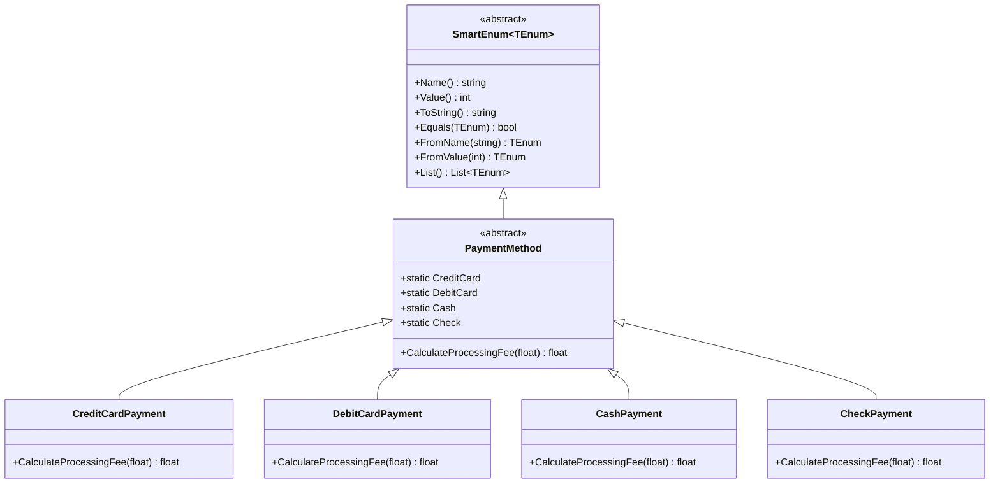
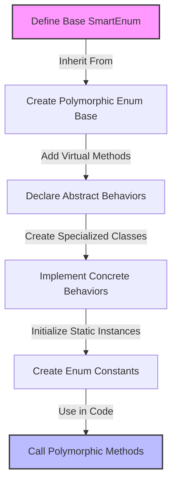

# SmartEnumProject

This project is a C++ port of the Ardalis.SmartEnum C# library providing type-safe "smart" enum types and flag enums.

## Features

- **SmartEnum**: Supports name/value registration, lookup (by name and value), and equality comparison.
- **Polymorphic Enums**: Allows custom behavior per enum instance.
- **SmartFlagEnum**: Implements flags with combination logic and validates power-of-two flag definitions.
- **Fluent Switch Interface**: Provides a chainable switch-like API for enums.
- **Unit Tests**: GoogleTest-based tests verify the behavior.

## Examples

### Basic SmartEnum

```cpp
#include <SmartEnumCpp/SmartEnum.hpp>
#include <iostream>

// Define a basic SmartEnum
class Color : public SmartEnum<Color> {
public:
    // Define enum constants
    static const Color Red;
    static const Color Green;
    static const Color Blue;
    
private:
    // Constructor is private, constants are defined outside the class
    Color(const std::string& name, int value) : SmartEnum(name, value) {}
};

// Initialize the constants
const Color Color::Red("Red", 1);
const Color Color::Green("Green", 2);
const Color Color::Blue("Blue", 3);

int main() {
    // Access enum values
    std::cout << "Color Red: " << Color::Red.Name() << " = " << Color::Red.Value() << std::endl;
    
    // Lookup by name
    const Color& foundColor = Color::FromName("Green");
    std::cout << "Found color: " << foundColor.Name() << std::endl;
    
    // Lookup by value
    const Color& colorByValue = Color::FromValue(3);
    std::cout << "Color with value 3: " << colorByValue.Name() << std::endl;
    
    // List all defined values
    std::cout << "All colors:" << std::endl;
    for (const Color* color : Color::List()) {
        std::cout << " - " << color->Name() << std::endl;
    }
    
    return 0;
}
```

### Polymorphic SmartEnum

```cpp
#include <SmartEnumCpp/SmartEnum.hpp>
#include <iostream>

// Define a polymorphic SmartEnum with behavior
class PaymentMethod : public SmartEnum<PaymentMethod> {
public:
    static const PaymentMethod CreditCard;
    static const PaymentMethod DebitCard;
    static const PaymentMethod Cash;
    static const PaymentMethod Check;
    
    // Custom behavior method
    virtual float CalculateProcessingFee(float amount) const = 0;
    
protected:
    // Protected constructor for derived classes
    PaymentMethod(const std::string& name, int value) : SmartEnum(name, value) {}
};

// Implement specific behavior for each payment method
class CreditCardPayment : public PaymentMethod {
public:
    CreditCardPayment() : PaymentMethod("CreditCard", 1) {}
    
    float CalculateProcessingFee(float amount) const override {
        return amount * 0.03f; // 3% fee
    }
};

class DebitCardPayment : public PaymentMethod {
public:
    DebitCardPayment() : PaymentMethod("DebitCard", 2) {}
    
    float CalculateProcessingFee(float amount) const override {
        return amount * 0.01f; // 1% fee
    }
};

class CashPayment : public PaymentMethod {
public:
    CashPayment() : PaymentMethod("Cash", 3) {}
    
    float CalculateProcessingFee(float amount) const override {
        return 0.0f; // No fee
    }
};

class CheckPayment : public PaymentMethod {
public:
    CheckPayment() : PaymentMethod("Check", 4) {}
    
    float CalculateProcessingFee(float amount) const override {
        return 1.0f; // Fixed $1 fee
    }
};

// Initialize the payment method constants
const PaymentMethod PaymentMethod::CreditCard = CreditCardPayment();
const PaymentMethod PaymentMethod::DebitCard = DebitCardPayment();
const PaymentMethod PaymentMethod::Cash = CashPayment();
const PaymentMethod PaymentMethod::Check = CheckPayment();

int main() {
    float purchaseAmount = 100.0f;
    
    for (const PaymentMethod* method : PaymentMethod::List()) {
        float fee = method->CalculateProcessingFee(purchaseAmount);
        std::cout << "Payment method: " << method->Name()
                  << ", Processing fee: $" << fee << std::endl;
    }
    
    return 0;
}
```

### SmartFlagEnum Example

```cpp
#include <SmartEnumCpp/SmartFlagEnum.hpp>
#include <iostream>

// Define a flag enum for permissions
class Permissions : public SmartFlagEnum<Permissions, int> {
public:
    static const Permissions None;
    static const Permissions Read;
    static const Permissions Write;
    static const Permissions Execute;
    
private:
    Permissions(const std::string& name, int value) : SmartFlagEnum(name, value) {}
};

// Initialize the flag values (must be powers of 2)
const Permissions Permissions::None("None", 0);
const Permissions Permissions::Read("Read", 1);
const Permissions Permissions::Write("Write", 2);
const Permissions Permissions::Execute("Execute", 4);

int main() {
    // Combine flags using the | operator
    int rwPermissions = Permissions::Read | Permissions::Write;
    
    // Convert back to flag names
    std::string permissionsStr = Permissions::FromValueToString(rwPermissions);
    std::cout << "Permissions: " << permissionsStr << std::endl;
    
    // Get individual flags from a combined value
    std::vector<const Permissions*> flags = Permissions::FromValue(rwPermissions);
    std::cout << "Flag count: " << flags.size() << std::endl;
    for (const Permissions* flag : flags) {
        std::cout << " - " << flag->Name() << std::endl;
    }
    
    return 0;
}
```

### Using the Fluent Switch

```cpp
#include <SmartEnumCpp/SmartEnum.hpp>
#include <SmartEnumCpp/SmartEnumSwitch.hpp>
#include <iostream>

// Define a simple enum
class Status : public SmartEnum<Status> {
public:
    static const Status Pending;
    static const Status Active;
    static const Status Suspended;
    static const Status Closed;
    
private:
    Status(const std::string& name, int value) : SmartEnum(name, value) {}
};

// Initialize the status constants
const Status Status::Pending("Pending", 0);
const Status Status::Active("Active", 1);
const Status Status::Suspended("Suspended", 2);
const Status Status::Closed("Closed", 3);

void processStatus(const Status& status) {
    SwitchOn(status)
        .When(Status::Pending).Then([]() {
            std::cout << "Status is pending - awaiting activation" << std::endl;
        })
        .When(Status::Active).Then([]() {
            std::cout << "Status is active - proceed normally" << std::endl;
        })
        .When(Status::Suspended).Then([]() {
            std::cout << "Status is suspended - limited operations allowed" << std::endl;
        })
        .Default([]() {
            std::cout << "Status is closed or unknown" << std::endl;
        });
}

int main() {
    processStatus(Status::Pending);
    processStatus(Status::Active);
    processStatus(Status::Suspended);
    processStatus(Status::Closed);
    
    return 0;
}
```

## Polymorphic Enums - Class Hierarchy

Polymorphic enums provide instance-specific behavior by leveraging class inheritance:



## Polymorphic Enum Flow

This diagram shows the flow of creating and using polymorphic enums:



## Build Instructions

This project uses CMake. From the root directory:

```bash
mkdir build
cd build
cmake ..
cmake --build .
ctest
```
